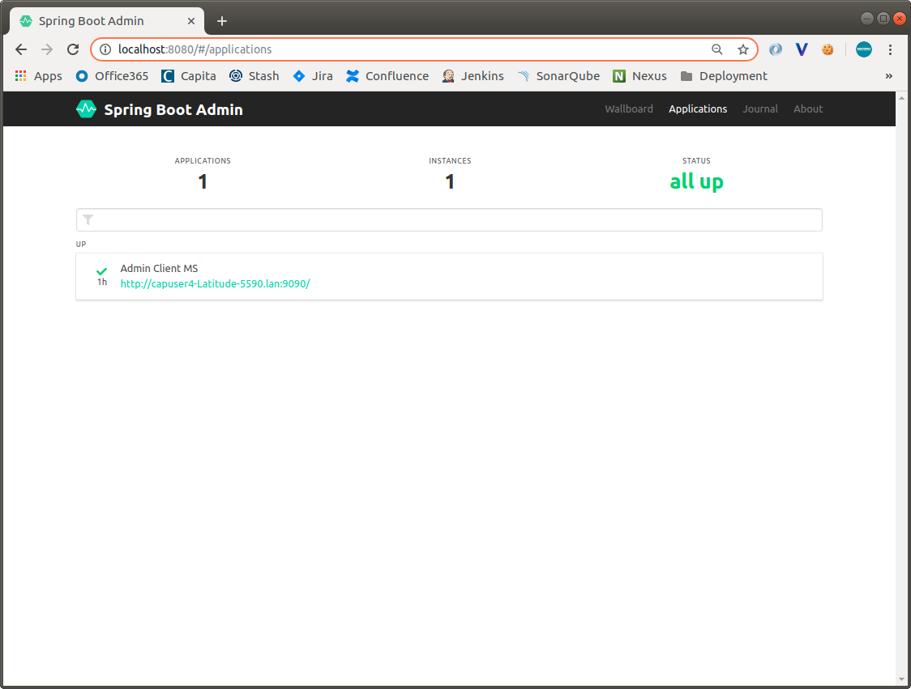
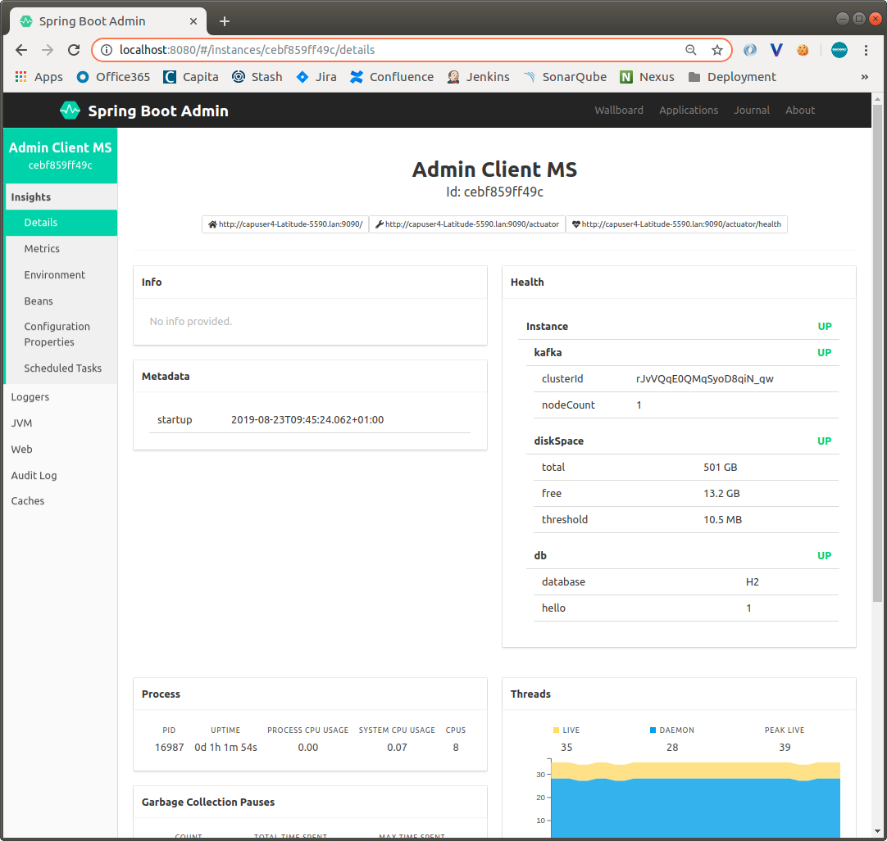
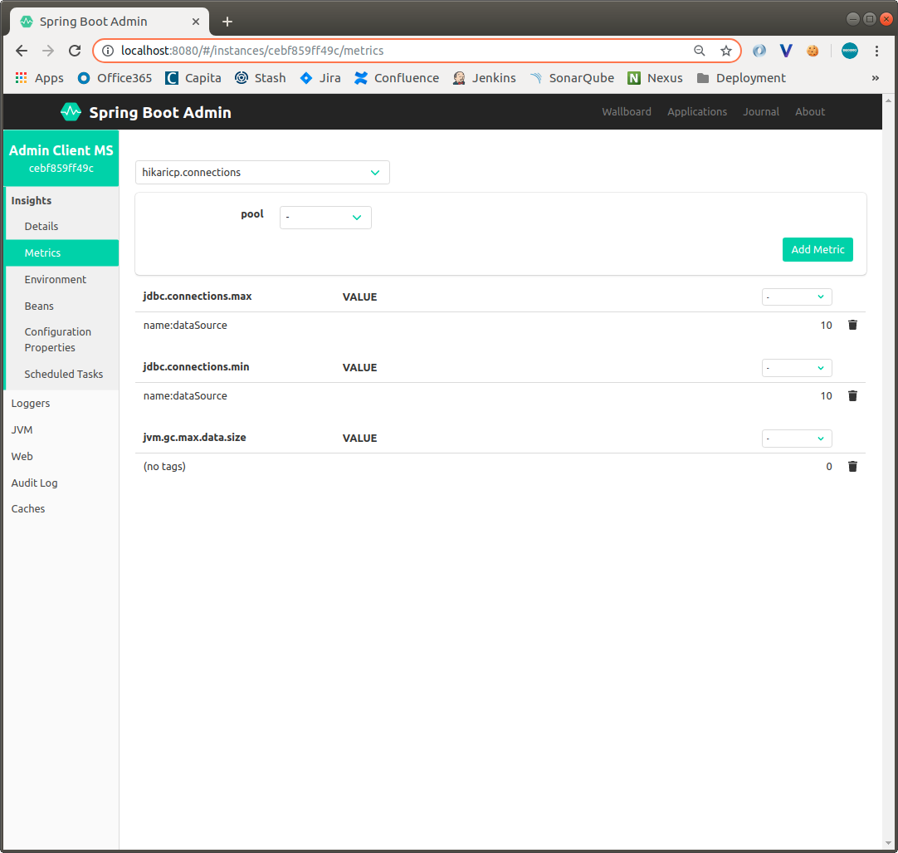

# Example Spring Admin Server and Client

## Purpose
This setup up of the Spring Admin Server was used to showcase a _very simple_ example of the Spring Admin Server and 
an Atlas Time Series database.

## Setup
There are 3 directories:
1. `atlas` - the atlas directory contains a download of the Atlas server. 
Run using `java -jar atlas-x.x.x-standalone.jar memory.conf`
1. `example.admin.server` - Spring Boot Admin Server
1. `example.admin.client` - Spring Boot Application Admin Client. Spring Kafka included with a simple endpoint to
publish to a topic (included to show example of the Kafka metrics on the Admin Server - I run Kafka via docker using
`docker run -p 2181:2181 -p 9092:9092 --env ADVERTISED_HOST=localhost --env ADVERTISED_PORT=9092 spotify/kafka`). 

    Also has a `SimulationController` which generates stats for the Atlas server - this is a copy of the Simulation 
provided in the [Embedding Atlas into a Spring Boot 2 App](https://github.com/jkschneider/atlas-embedded#embedding-atlas-into-a-spring-boot-2-app) Repo,
created by (Jon Schneider)[https://github.com/jkschneider] - thanks :)

The `atlas.html` also taken from Jon Schneider shows the Atlas statistics, and is available on both the client and server
to show how you may want to embed specific charts on both applications, available at `<root>/atlas.html`

## Images
Some screenshots of the Admin Server / Client:

Admin Home: 

Admin Client MS Page: 

Admin Client MS Metrics Page: 

